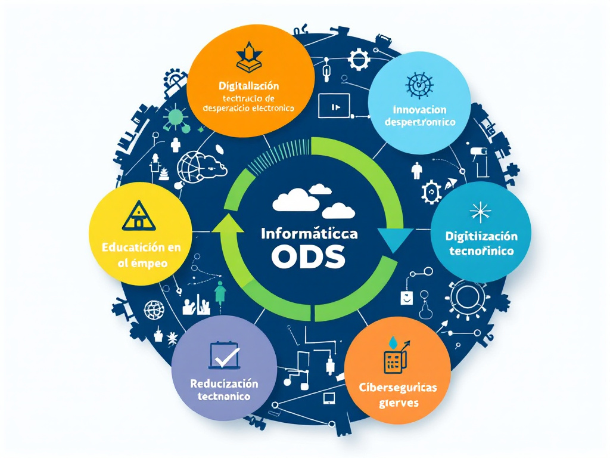
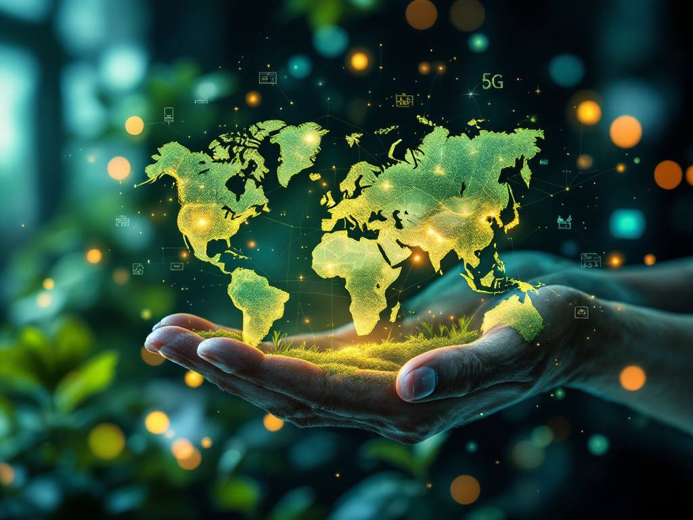
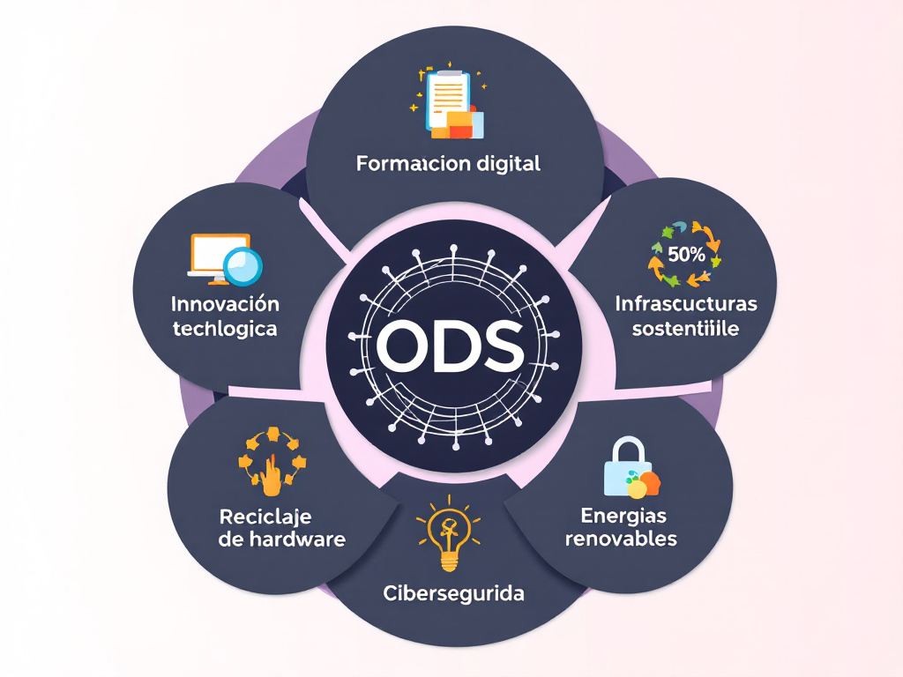

# 🌍 1.1 El Sector Productivo Vinculado a la Familia Profesional de la Informática y las Comunicaciones

El sector de **informática y telecomunicaciones** es clave en la transformación digital y el desarrollo sostenible. 🌱💻 Este sector permite la innovación en diversas áreas, desde el desarrollo de software hasta la ciberseguridad.

## 🏢 Nuestro Sector Productivo

La industria informática abarca múltiples especialidades, cada una con un impacto en la sostenibilidad y la economía. 🌏📈

|🖥️ **Subsector**|📌 **Descripción**|🌱 **Impacto en la Sostenibilidad**|
|---|---|---|
|💻 Desarrollo de Software|Creación de programas y aplicaciones.|Optimización de procesos y reducción del uso de papel. 📉📄|
|🔐 Ciberseguridad|Protección de datos y privacidad.|Garantiza la seguridad digital y previene fraudes. 🔒|
|📡 Telecomunicaciones|Infraestructura para conectividad global.|Expansión del acceso a internet en zonas rurales. 🌍📶|
|☁️ Computación en la Nube|Almacenamiento y procesamiento en la nube.|Reduce el consumo de hardware y energía. ⚡|
|🤖 Inteligencia Artificial|Automatización y análisis de datos.|Mejora la eficiencia y toma de decisiones. 🔬💡|

🔗 **Consulta también:** [ODS Más Relevantes en Nuestro Sector](#-ods-m%C3%A1s-relevantes-de-nuestro-sector-productivo)

## 🎯 ODS Más Relevantes de Nuestro Sector Productivo

El sector de la informática contribuye directamente a varios **Objetivos de Desarrollo Sostenible (ODS)**. 🎯🌱 A continuación, se detallan los más importantes:

|🌍 **ODS**|📌 **Descripción**|🔍 **Justificación**|
|---|---|---|
|**ODS 4** 📚|Educación de calidad|La tecnología facilita el acceso a educación en línea.|
|**ODS 8** 💼|Trabajo decente y crecimiento económico|Fomenta la digitalización del empleo y la equidad laboral.|
|**ODS 9** 🏗️|Industria, innovación e infraestructura|Mejora la conectividad y el acceso a tecnologías avanzadas.|
|**ODS 12** ♻️|Producción y consumo responsables|Disminuye el desperdicio electrónico y fomenta el reciclaje.|
|**ODS 13** 🌍|Acción por el clima|Implementación de tecnologías verdes y reducción de CO₂.|
|**ODS 16** ⚖️|Paz, justicia e instituciones sólidas|Protección de datos y ciberseguridad a nivel global.|

⚡ **Importancia:** La tecnología es un motor para el desarrollo sostenible, reduciendo desigualdades y promoviendo eficiencia energética. 🌱💡

🔗 **Consulta también:** [Metas Específicas de los ODS](#-objetivos-y-metas-espec%C3%ADficas-de-los-ods-aplicables-a-nuestro-sector-productivo)

## 📌 Selección de los ODS Más Relevantes y Justificación

🎯 **Criterios de Selección:**

🔹 **Impacto en la digitalización global** 🌐  
🔹 **Innovación y eficiencia tecnológica** 🏭💻  
🔹 **Reducción de la huella ecológica** 🍃

Ejemplo de cómo se aplica cada ODS:

> **ODS 4 (Educación de Calidad)**: Plataformas como **Coursera, Udemy y Khan Academy** democratizan el acceso al conocimiento. 🎓📱

> **ODS 9 (Industria, Innovación e Infraestructura)**: Redes 5G mejoran la conectividad y el acceso a información en tiempo real. 📡⚡

🔗 **Consulta también:** [Impacto de la Tecnología en la Sostenibilidad](#-conclusi%C3%B3n)

## 🎯 Objetivos y Metas Específicas de los ODS Aplicables a Nuestro Sector Productivo

| 🌱 **ODS**    | 🎯 **Meta**                                                              | 📌 **Aplicación en Informática**                                             |
| ------------- | ------------------------------------------------------------------------ | ---------------------------------------------------------------------------- |
| **ODS 4** 📚  | **Meta 4.4**: Aumentar la cantidad de jóvenes con habilidades digitales. | Formación en ciberseguridad, programación y análisis de datos. 📊            |
| **ODS 8** 💼  | **Meta 8.2**: Mejorar la productividad económica mediante innovación.    | Implementación de IA y automatización. 🤖                                    |
| **ODS 9** 🏗️ | **Meta 9.1**: Desarrollar infraestructuras resilientes y sostenibles.    | Expansión de fibra óptica y redes 5G. 📶                                     |
| **ODS 12** ♻️ | **Meta 12.5**: Reducir la generación de desechos electrónicos.           | Programas de reciclaje de hardware y optimización del consumo energético. 🔋 |
| **ODS 13** 🌍 | **Meta 13.2**: Integrar medidas climáticas en estrategias nacionales.    | Uso de energías renovables en centros de datos. ☀️⚡                          |
| **ODS 16** ⚖️ | **Meta 16.4**: Mejorar la ciberseguridad global.                         | Protección contra ciberataques y regulación de privacidad. 🔐                |

🔗 **Consulta también:** [Ejemplos de Aplicación en Empresas](#-conclusi%C3%B3n)

## 🚀 Conclusión

El sector de la **informática y telecomunicaciones** tiene un impacto transformador en la sostenibilidad. 🌎💻 Contribuye a los **ODS** mediante:

✅ **Digitalización de la educación** 📚  
✅ **Reducción de la brecha digital** 🌍  
✅ **Optimización energética en centros de datos** ⚡  
✅ **Fomento del reciclaje electrónico** ♻️

📌 **Dato Importante**: Se estima que la digitalización podría reducir hasta un **20%** las emisiones globales de CO₂ para 2030[^1]).

💡 **Siguiente Paso:** Implementar más políticas de desarrollo tecnológico sostenible para maximizar el impacto positivo. 🌱🚀

🔗 **Consulta también:** [Nuestro Sector Productivo](#-nuestro-sector-productivo)

---
## 🔙 **Retornar al Índice**  
📌 **[⬅️ Regresar al Índice Principal](../indice_pisa3_B_zavaleta)**

---
## 📑 Referencias

## Footnotes
[^1]: Naciones Unidas. (2023). _Informe sobre Digitalización y Sostenibilidad_. Disponible en [un.org](https://www.un.org/es/) 🌍. 