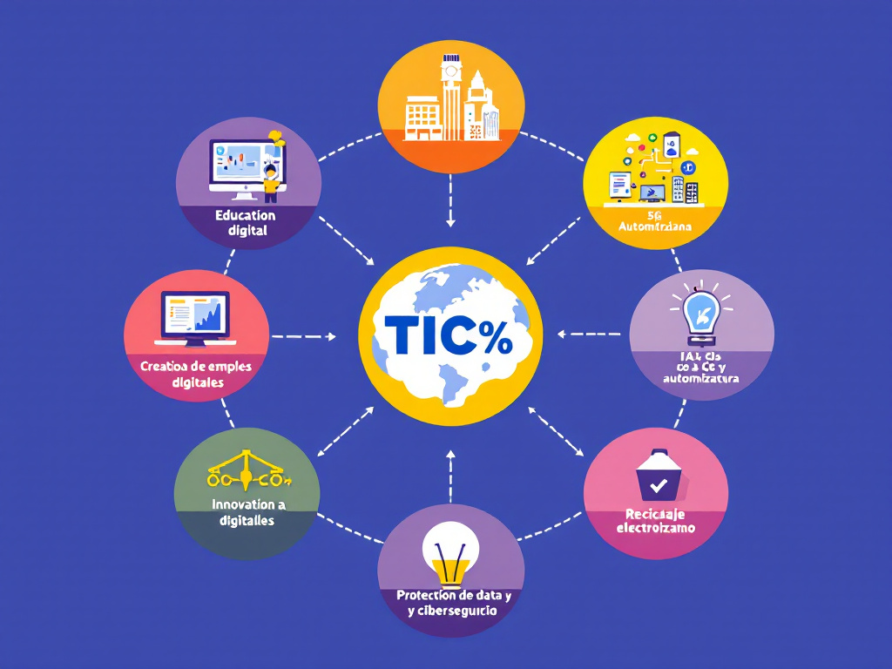

# 🌍 ODS Más Relevantes en el Sector TIC

La **informática y las telecomunicaciones** juegan un papel clave en los **Objetivos de Desarrollo Sostenible (ODS)** 🌱💻, impactando áreas como la educación, el empleo, la innovación y la sostenibilidad.

---

## 🎯 ODS Claves

| 🎯 **ODS**    | 🌱 **Nombre**                | 📌 **Impacto en TIC**                 |
| ------------- | ---------------------------- | ------------------------------------- |
| **ODS 4** 📚  | Educación de Calidad         | Acceso a formación digital.           |
| **ODS 8** 💼  | Trabajo Decente              | Creación de empleos digitales.        |
| **ODS 9** 🏗️ | Innovación e Infraestructura | IA, 5G y automatización.              |
| **ODS 12** ♻️ | Producción Responsable       | Reciclaje electrónico.                |
| **ODS 16** ⚖️ | Justicia y Seguridad         | Protección de datos y ciberseguridad. |

🔗 **Consulta también:** [Metas específicas](#-objetivos-y-metas-espec%C3%ADficas)

---

## 📌 Justificación

✅ **ODS 4** 📚: Plataformas digitales democratizan el aprendizaje.  
✅ **ODS 8** 💼: Teletrabajo y economía digital en crecimiento.  
✅ **ODS 9** 🏗️: Expansión de fibra óptica y redes 5G.  
✅ **ODS 12** ♻️: Disminución de residuos electrónicos.  
✅ **ODS 13** 🌍: Uso de energías renovables en centros de datos.  
✅ **ODS 16** ⚖️: Seguridad digital y prevención del cibercrimen.

💡 _Ejemplo:_ **Google y Microsoft** apuestan por IA y sostenibilidad.

---

## 🎯 Objetivos y Metas Específicas

|🌱 **ODS**|🎯 **Meta**|📌 **Aplicación TIC**|
|---|---|---|
|**ODS 4** 📚|**4.4**: Aumentar habilidades digitales.|Formación en ciberseguridad y programación.|
|**ODS 8** 💼|**8.2**: Mejorar productividad con tecnología.|Implementación de IA y automatización.|
|**ODS 9** 🏗️|**9.1**: Infraestructura resiliente.|Redes 5G y ciudades inteligentes.|
|**ODS 12** ♻️|**12.5**: Reducir desechos electrónicos.|Reciclaje y economía circular.|
|**ODS 13** 🌍|**13.2**: Integrar medidas climáticas.|Energía renovable en TIC.|
|**ODS 16** ⚖️|**16.4**: Combatir el cibercrimen.|Protección de datos y seguridad digital.|

---

## 🚀 Conclusión

✅ **Impacto del sector TIC en los ODS**:

- 🌎 **Reducción de la brecha digital**.
- ♻️ **Consumo energético optimizado**.
- 🔐 **Mayor seguridad en internet**.

📌 **Dato Clave**: La digitalización puede reducir **20%** de emisiones globales de CO₂ para 2030[1](#user-content-fn-1).

🔗 **Consulta también:** [Nuestro Sector Productivo](#-ods-claves)

---

## 📑 Referencias

## Footnotes

1. Naciones Unidas. (2023). _Informe sobre TIC y Sostenibilidad_. [un.org](https://www.un.org/es/) 🌍. [↩](#user-content-fnref-1)

---
## 🔙 **Retornar al Índice**  
📌 **[⬅️ Regresar al Índice Principal](../indice_pisa3_B_zavaleta)**
