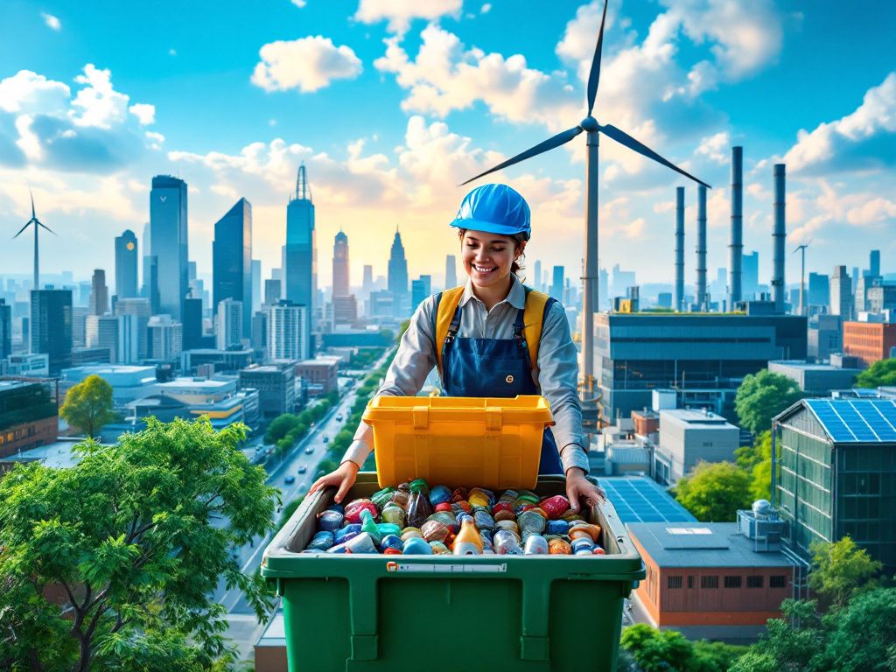
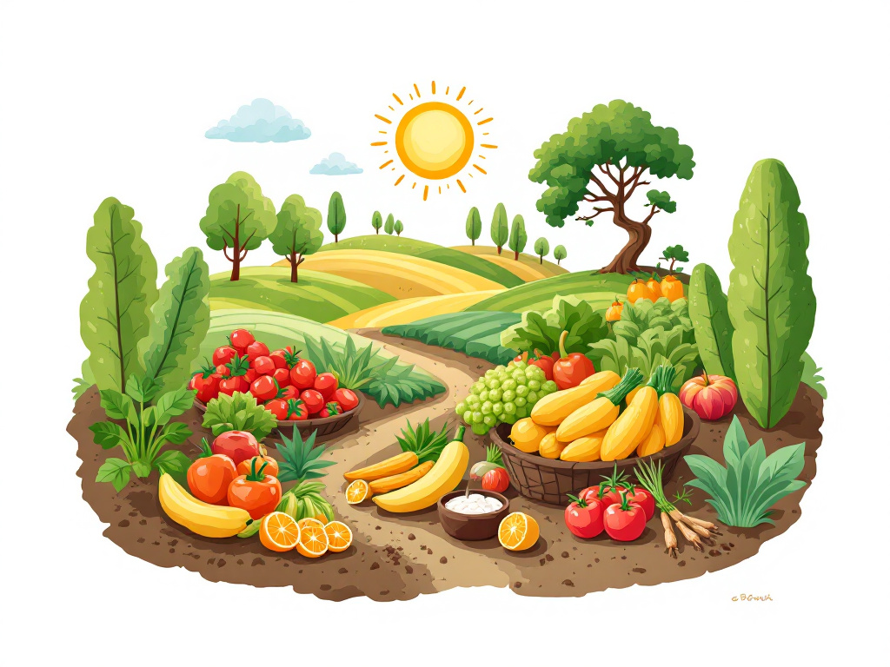
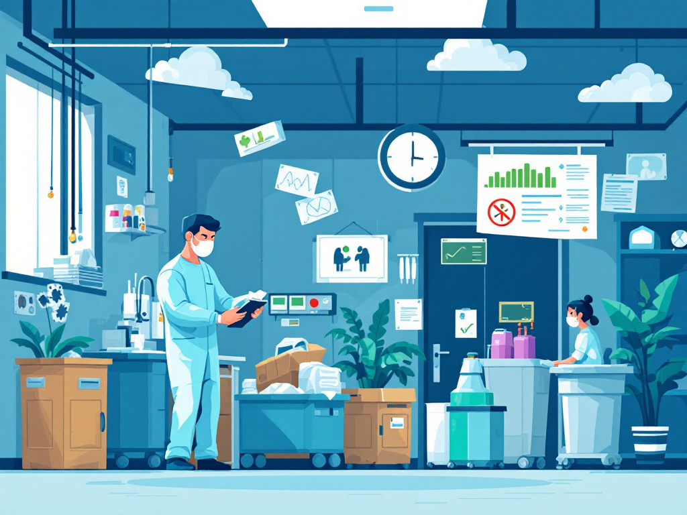

# 🌍 **Identificación de los Aspectos de Sostenibilidad y ODS más Relevantes en Cada Sector Productivo** 🌿  

La **sostenibilidad** es clave para un desarrollo equilibrado y justo. Cada sector tiene un impacto distinto en los **Objetivos de Desarrollo Sostenible (ODS)** 🌏📜, definidos por la ONU. A continuación, exploramos cómo cada sector puede contribuir:  

---

## 🛍 **1. Comercio y Distribución**  

🔹 **Aspectos de Sostenibilidad:**  
- 🛒 **Consumo Responsable:** Promover productos sostenibles y reducir el desperdicio.  
- 🚛 **Transporte Verde:** Optimización de rutas y uso de vehículos eléctricos.  
- 🔄 **Gestión de Residuos:** Uso de empaques biodegradables y reciclables.  

🌎 **ODS Relacionados:**  
✅ **ODS 12:** Producción y Consumo Responsables ♻️  
✅ **ODS 13:** Acción por el Clima 🌱  
✅ **ODS 9:** Innovación en la Industria ⚙️  

---

## 🏗 **2. Construcción e Ingeniería Civil**  

🔹 **Aspectos de Sostenibilidad:**  
- 🏠 **Eficiencia Energética:** Edificios con bajo consumo energético.  
- 🧱 **Materiales Sostenibles:** Uso de materiales reciclados.  
- 💧 **Gestión del Agua:** Reutilización y recolección de agua de lluvia.  

🌎 **ODS Relacionados:**  
✅ **ODS 11:** Ciudades y Comunidades Sostenibles 🏙  
✅ **ODS 9:** Innovación en Infraestructura 🚧  
✅ **ODS 6:** Agua Limpia y Saneamiento 🚰  

---

## 🌾 **3. Sector Agroalimentario**  

🔹 **Aspectos de Sostenibilidad:**  
- 🌱 **Agricultura Sostenible:** Reducción de agroquímicos y uso eficiente del suelo.  
- 🍽 **Reducción del Desperdicio Alimentario:** Aprovechamiento de excedentes.  
- 💦 **Gestión del Agua:** Riego eficiente y conservación de fuentes hídricas.  

🌎 **ODS Relacionados:**  
✅ **ODS 2:** Hambre Cero 🍎  
✅ **ODS 12:** Producción Responsable 🍃  
✅ **ODS 15:** Protección de Ecosistemas Terrestres 🌲  

---

## 💊 **4. Farmacéutico y Sanitario**  

🔹 **Aspectos de Sostenibilidad:**  
- 🏥 **Acceso Equitativo a la Salud:** Atención médica para todos.  
- 🧪 **Innovación en Medicamentos:** Desarrollo de tratamientos más ecológicos.  
- 🚮 **Gestión de Residuos Médicos:** Eliminación segura de desechos.  

🌎 **ODS Relacionados:**  
✅ **ODS 3:** Salud y Bienestar ❤️  
✅ **ODS 9:** Innovación Científica 🔬  
✅ **ODS 12:** Producción Responsable ♻️ 

---

## 🏭 **5. Sector Industrial**  

🔹 **Aspectos de Sostenibilidad:**  
- ⚡ **Eficiencia Energética:** Reducción del consumo energético.  
- 🌫 **Reducción de Emisiones:** Uso de energías limpias.  
- 🔁 **Economía Circular:** Reciclaje y reutilización de materiales.  

🌎 **ODS Relacionados:**  
✅ **ODS 9:** Innovación en la Industria 🔩  
✅ **ODS 12:** Producción Responsable 🏗  
✅ **ODS 13:** Acción Climática 🌱  

---

## 💰 **6. Servicios Financieros de Banca y Seguros**  

🔹 **Aspectos de Sostenibilidad:**  
- 🌿 **Finanzas Sostenibles:** Inversión en proyectos ecológicos.  
- 🤝 **Inclusión Financiera:** Acceso a créditos para todos.  
- 📊 **Gestión de Riesgos:** Evaluación de impactos ambientales en inversiones.  

🌎 **ODS Relacionados:**  
✅ **ODS 8:** Trabajo Decente 💼  
✅ **ODS 10:** Reducción de Desigualdades ⚖️  
✅ **ODS 17:** Alianzas para el Desarrollo 🤝  

---

## 💼 **7. Servicios Profesionales**  

🔹 **Aspectos de Sostenibilidad:**  
- 📜 **Prácticas Éticas:** Aplicación de códigos de conducta responsables.  
- 🎓 **Capacitación Continua:** Formación en sostenibilidad.  
- 🤲 **Responsabilidad Social Corporativa:** Participación en proyectos comunitarios.  

🌎 **ODS Relacionados:**  
✅ **ODS 8:** Trabajo Decente 👩‍💻  
✅ **ODS 4:** Educación de Calidad 📖  
✅ **ODS 16:** Justicia e Instituciones Sólidas ⚖️  

---

## 📡 **8. Telecomunicaciones y Nuevas Tecnologías**  

🔹 **Aspectos de Sostenibilidad:**  
- 🌍 **Acceso Universal a la Información:** Reducción de la brecha digital.  
- ⚡ **Eficiencia Energética:** Desarrollo de tecnología con menor consumo.  
- 🖥 **Gestión de Residuos Electrónicos:** Reciclaje de dispositivos.  

🌎 **ODS Relacionados:**  
✅ **ODS 9:** Innovación Tecnológica 🤖  
✅ **ODS 4:** Educación Digital 📡  
✅ **ODS 12:** Producción Responsable 🔄

---
## 🔙 **Retornar al Índice**  
📌 **[⬅️ Regresar al Índice Principal](../indice_pisa3_B_zavaleta)**
