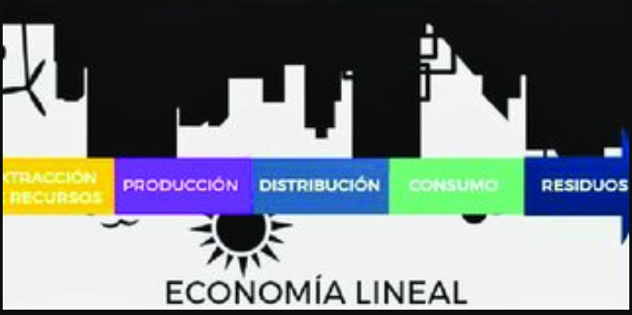
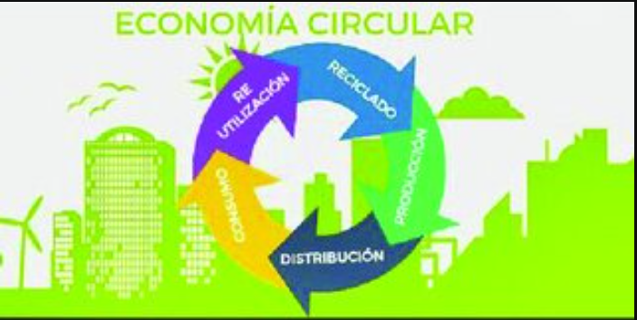

# 5. Principios de la economía verde y circular

Frente a los retos globales generados por el modelo de producción y consumo lineal, han surgido nuevas propuestas económicas que promueven un uso más sostenible y eficiente de los recursos. La economía verde, la economía azul y la economía circular son conceptos clave que buscan abordar estos desafíos mediante la integración de prácticas responsables, la protección de los ecosistemas y la minimización de los impactos ambientales.  

En este documento se presentan, en primer lugar, las diferencias entre la economía lineal y la economía circular, destacando las transiciones necesarias para adoptar este modelo más sostenible. En segundo lugar, se analizan los principios de las economías verde y azul, y cómo estas ofrecen una alternativa al modelo clásico basado en la explotación desmedida de recursos.  

