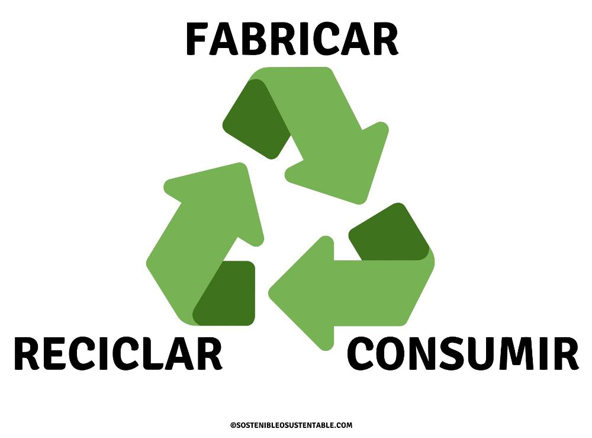

# 6. Beneficios de la Economía Verde y Circular Frente al Modelo Clásico de Producción

La economía verde y circular ofrece una alternativa más sostenible al modelo clásico de producción. A continuación, se describen los beneficios clave en los ámbitos económico, social y ambiental.  
  

## Beneficios Económicos

1. **Ahorro de costos a largo plazo**: La economía circular promueve el uso eficiente de los recursos, lo que permite reducir los costos de materiales y energía. Las empresas pueden optimizar sus procesos productivos y minimizar el desperdicio.
2. **Generación de nuevos empleos**: El modelo verde y circular fomenta la creación de nuevos sectores y puestos de trabajo relacionados con el reciclaje, la reutilización y la reparación de productos. Esto contribuye al crecimiento de la economía local.
3. **Incentivos para la innovación**: El impulso a la investigación y desarrollo en tecnologías limpias y sostenibles genera nuevas oportunidades de negocio y posiciona a las empresas como líderes en el mercado verde.

> "La economía circular es el camino para generar crecimiento económico y empleo, mientras se respetan los límites planetarios." – Ellen MacArthur

## Beneficios Sociales

1. **Mejora de la calidad de vida**: Las políticas verdes favorecen un entorno más saludable, reduciendo la contaminación y los riesgos de enfermedades relacionadas con la degradación ambiental.
2. **Equidad social**: La economía circular promueve la colaboración y la creación de una economía inclusiva donde los recursos son gestionados de manera más justa, lo que puede contribuir a la reducción de desigualdades.
3. **Empoderamiento comunitario**: Fomenta la participación activa de las comunidades en la gestión de recursos, lo que fortalece los lazos sociales y promueve la conciencia medioambiental.

## Beneficios Ambientales

1. **Reducción de emisiones de CO2**: Al reducir el uso de recursos vírgenes y fomentar el reciclaje, la economía circular contribuye de manera significativa a la disminución de las emisiones de gases de efecto invernadero, ayudando a combatir el cambio climático.
2. **Conservación de recursos naturales**: En lugar de depender de la extracción constante de materias primas, el modelo circular promueve la reutilización y el reciclaje, lo que reduce la presión sobre los ecosistemas y conserva los recursos naturales.
3. **Minimización de residuos**: En la economía circular, los productos y materiales se mantienen en uso durante más tiempo, reduciendo la cantidad de residuos generados y, por ende, los impactos negativos en vertederos y el medio ambiente.

## Conclusión

La transición hacia una economía verde y circular presenta beneficios tangibles y medibles en tres áreas clave: lo económico, lo social y lo ambiental. Este modelo no solo ayuda a mejorar la eficiencia y la competitividad empresarial, sino que también fomenta una mayor equidad y protege el planeta para las futuras generaciones.  
